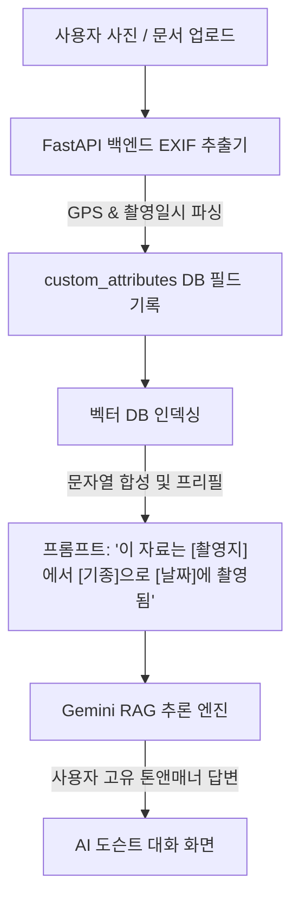

# 🌌 REMEMBERY (리멤버리)
### *인간의 삶과 유산을 기록하는 디지털 헤리티지 아카이브 & AI 미술관*

<p align="center">
  
</p>

<p align="center">
  <a href="https://react.dev/"></a>
  <a href="https://tailwindcss.com/"></a>
  <a href="https://www.typescriptlang.org/"></a>
  <a href="https://fastapi.tiangolo.com/"></a>
  <a href="https://deepmind.google/technologies/gemini/"></a>
  <a href="https://www.sqlite.org/"></a>
</p>

<p align="center">
  🌐 <b>Read this in:</b> <a href="README.md"><b>English (영어)</b></a> | 📖 <b>전체 이용 가이드:</b> <a href="MANUAL_ko.md"><b>한국어 매뉴얼</b></a> / <a href="MANUAL.md"><b>영어 매뉴얼</b></a>
</p>

---

> [!NOTE]
> **Remember (기억하다) + Library (도서관)**  
> *"모든 인간의 삶은 하나의 거대한 도서관과 같습니다. 그 도서관이 먼지 속에 잊히지 않도록 영원히 흐르는 등불을 밝히고, 당신의 지식과 목소리를 세대를 넘어 고스란히 전합니다."*

---

## 💡 1. 서비스 비전과 철학 (Vision & Philosophy)

기존의 디지털 추모 사이트나 지식 관리 도구들은 뚜렷한 한계를 가지고 있었습니다:
*   **감성적 추모 서비스의 한계**: 고인을 기리는 데 집중하지만, 기술적 깊이(지식 검색, 다차원 미디어 아카이빙, AI 대화)가 부재하여 단순한 방명록과 사진첩 나열에 머무릅니다.
*   **이성적 KM 툴의 한계**: Notion이나 Obsidian 같은 도구들은 데이터 관리에는 강하나, 인생의 온기나 유산을 기념하고 세대를 잇는 감성적 예술 가치(전시관, 스토리텔링)가 결여되어 있어 건조합니다.

**Remembery**는 이 두 한계를 허물고 **"이성적 지식 아카이브와 감성적 디지털 기념관의 완벽한 융합"**을 제공합니다:

```text
┌─────────────────────────────────────────────────────────────────────────┐
│                       아카이빙의 패러다임 시프트 (Remembery)            │
├────────────────────────────────────────┬────────────────────────────────┤
│      기존 아카이브 (건조하고 정적인 보관)    │      Remembery (따뜻하고 동적인 유산)  │
├────────────────────────────────────────┼────────────────────────────────┤
│  • 단순 클라우드 보관 (파일 및 폴더 나열)  │  • 시네마틱 라이프 타임라인 흐름      │
│  • 정적인 소셜 미디어 피드             │  • AI 자동 큐레이션 가상 테마 미술관   │
│  • 비구조화되고 단절된 기억들          │  • EXIF 데이터 연동 시공간 지오코딩    │
│  • 검색이 불가능한 평면적 추억 박스      │  • 나를 학습한 영원의 대화형 AI 도슨트  │
└────────────────────────────────────────┴────────────────────────────────┘
```

*   **생전 (Alive)**: 본인의 커리어, 연구 성과, 깊은 사색이 담긴 편지와 일기를 체계적으로 보관하고 관리하는 기품 있는 포트폴리오 창고로 작동합니다.
*   **사후 (Legacy)**: 어떠한 수동 마이그레이션도 없이, 소중한 기록물들이 후손들을 위한 가장 따뜻하고 영구적인 디지털 개인 기념 박물관으로 부드럽게 이어집니다.

---

## 🚀 2. 핵심 지능형 기능 (Intelligent Features)

Remembery는 우아한 프론트엔드 UI/UX와 백엔드의 고도화된 AI 파이프라인이 유기적으로 결합하여 프리미엄 사용자 경험을 선사합니다:

### 🤖 진정한 RAG 기반 AI 도슨트 & 속성 합성 엔진
방문자들이 아카이브에 질문을 던지면, 당신이 남긴 기록물의 톤앤매너와 지식을 학습하여 당신의 목소리로 지적으로 답변합니다. **Gemini API** 기반 RAG 검색 파이프라인은 카테고리별 동적 속성(예: *“이 논문은 [홍길동]이 작성했으며, [Nature] 저널에 게재되었습니다.”*)을 프롬프트 내에 유기적으로 병합(String Synthesis)하여 검색 인덱싱 정확도를 극대화합니다.



### 🏛️ AI 큐레이팅 가상 테마 전시관
AI 큐레이터가 보관된 자료를 예술적으로 큐레이팅하여 테마별 가상 갤러리를 개설합니다.

| 테마 공간 🎨 | 비주얼 감성 (Visual Essence) 🏛️ | 경험 톤앤매너 |
| :--- | :--- | :--- |
| **Classic Museum** | 따뜻하고 아늑한 황토색과 부드러운 베이지 | 유서 깊은 미술관의 정취 |
| **Burgundy Classic** | 풍격이 느껴지는 매혹적인 딥 레드 | 깊은 사색과 이성적/감성적 깊이 |
| **Forest Heritage** | 수목원의 숨결을 머금은 싱그러운 보태니컬 그린 | 평화롭고 자연 친화적이며 성장을 상징 |
| **Ocean Deep** | 사색적이고 넓은 깊은 심해 청색 | 사색과 고요한 평정심의 울림 |
| **Charcoal Midnight** | 작품에 온전히 스포트라이트를 주는 명암 극대화 다크룸 | 현대적이고 극적인 Spotlight 집중 |

*   **4가지 기품 있는 레이아웃**: 
    1. `Docent Flow` (세로형 연대기 동선 배치)
    2. `Golden Frame Grid` (**클래식 액자 프레임**을 씌워 정렬하는 입체 대칭형 격자)
    3. `Cinematic Spotlight` (인용 세리프를 극적으로 노출하는 슬라이드 연출)
    4. `Bento Collage` (현대 미술전 스타일의 비대칭 Bento 격자)

### ⏳ 시네마틱 라이프 타임라인
자료의 ‘역사적 일자(Original Date)’를 기준으로 아카이브를 연대순 정렬하고, 출생 연도 기준 사건 당시의 실제 연령(예: `2026년 (48세)`)을 동적으로 계산하여 표시합니다. `IntersectionObserver` 네이티브 스크롤 리빌 애니메이션으로 인생 궤적을 돌아볼 때 극적인 몰입감을 제공합니다.

### 📚 하이브리드 커스텀 카테고리 & AI 추천
고정된 형태의 데이터 모델을 탈피하여, 논문, 편지, 일기, 여행기 등 어떠한 카테고리 스키마든 데이터베이스 내에 JSON 형태로 유연하게 보관합니다.
*   **AI 추천 필드 받기**: 새로운 보관 분류를 생성할 때, Gemini AI가 해당 카테고리에 필요한 메타데이터 속성명과 한국어 라벨을 추천하며, 체크박스 선택 한 번으로 즉시 동적 폼을 구축합니다.

### 📸 사진 EXIF 자동 파싱 및 스마트 폼 자동 완성
*   사용자가 사진 파일을 올리면, 즉석에서 백엔드가 파일 바이너리 헤더의 EXIF 데이터를 파싱합니다.
*   로딩 모션과 함께 화면 하단에 **`UploadPreview`** 카드가 나타나며 **촬영 일시**, **촬영 기기**, **GPS 위치 정보**를 예쁜 칩 형태로 시각화합니다.
*   **스마트 자동 입력 (Auto-fill)**: 사진에서 감지된 날짜를 **기록 당시 날짜** 폼에 맞추어 채워주고, 위경도 좌표를 카테고리 내 **촬영 장소** 입력 칸에 실시간으로 매핑해 줍니다.

---

## 🛠️ 3. 풀스택 기술 스택

Remembery는 장기적인 보존력과 뛰어난 이식성을 위해 신뢰도 높은 모던 스택으로 빌드되었습니다:

*   **프론트엔드 코어**: `React 19` + `TypeScript 6.0` + `Vite` (초고속 컴파일)
*   **디자인 시스템**: `Tailwind CSS v4` (CSS-first 컴파일러 기반의 부드럽고 수려한 레이아웃 설계)
*   **아이콘 및 모션**: `Lucide React` 및 네이티브 CSS 키프레임 트랜지션
*   **백엔드 API**: `FastAPI` (Asynchronous 비동기 아키텍처 기반 Python 초고속 서버)
*   **데이터베이스**: `SQLite` (파일 기반 이식성 극대화 RDBMS) + `SQLAlchemy 2.0` (선언적 ORM)
*   **메타데이터 추출**: `Pillow 11.3` (이미지 헤더 내 하드웨어 태그 파싱 및 fractional DMS 좌표 번역)
*   **AI 프레임워크**: `Gemini API` (콘텐츠 RAG 질의응답, 필드 추천 및 전시회 기획 연동)

---

## 💻 4. 시스템 아키텍처

```text
                                  +---------------------------------------+
                                  |            CLIENT BROWSER             |
                                  |   (React 19 + Tailwind CSS v4 SPA)    |
                                  +-------------------+-------------------+
                                                      |
                                           HTTPS      | Fetch APIs
                                     (JSON Payload)    | (Port 8000)
                                                      v
                                  +-------------------+-------------------+
                                  |          FASTAPI BACKEND SYSTEM       |
                                  |   (ASGI / CORSMiddleware Allowed)     |
                                  +---------+-------------------+---------+
                                            |                   |
                                            |                   |
                                     SQLAlchemy ORM             | Semantic RAG Search
                                     (Local Queries)            | (Pillow EXIF & Gemini)
                                            |                   |
                                            v                   v
                                  +---------+-------+   +-------+---------+
                                  | SQLite Database |   |   Gemini /      |
                                  | (remembery.db)  |   | Vector Database |
                                  +-----------------+   +-----------------+
```

---

## 🏃‍♂️ 5. 로컬 개발 환경 셋업 (Quick Start)

### 🔌 1) Backend API 셋업 (FastAPI)

1. **백엔드 폴더로 이동합니다:**
   ```bash
   cd backend
   ```

2. **가상환경을 구축하고 활성화합니다:**
   - **macOS / Linux:**
     ```bash
     python3 -m venv venv
     source venv/bin/activate
     ```
   - **Windows:**
     ```cmd
     python -m venv venv
     venv\Scripts\activate.bat
     ```

3. **의존성 라이브러리를 설치합니다:**
   ```bash
   pip install -r requirements.txt
   ```

4. **개발 서버를 가동합니다:**
   ```bash
   uvicorn app.main:app --reload
   ```

> [!TIP]
> *   백엔드 API 서버는 기본적으로 **`http://127.0.0.1:8000`** 포트에서 기동합니다.
> *   대화형 인터랙티브 스웨거 문서는 **`http://127.0.0.1:8000/docs`**에서 확인 가능합니다.

---

### 🎨 2) Frontend 셋업 (React + Vite)

1. **새 터미널에서 프론트엔드 폴더로 이동합니다:**
   ```bash
   cd frontend
   ```

2. **노드 패키지를 다운로드합니다:**
   ```bash
   npm install
   ```

3. **로컬 개발 서버를 가동합니다:**
   ```bash
   npm run dev
   ```

> [!NOTE]
> *   프론트엔드 서버는 기본적으로 **`http://localhost:5173`**에서 구동됩니다.
> *   해당 주소로 접속하면 글래스모피즘 기반의 고품격 Remembery 아카이브 대시보드가 열립니다.

---

## 📜 6. 완료된 마일스톤 및 향후 계획

- [x] **React 19 + Tailwind v4** 기반 프리미엄 다크 뮤지엄 대시보드 UI 개발
- [x] **FastAPI + SQLAlchemy + SQLite** 분리형 백엔드 CRUD 설계 및 통합
- [x] 온보딩 시스템 및 프로필 확장 메타데이터 구축 완료
- [x] 인생 연대기 **타임라인 플로우 (Timeline Flow)** 연령 자동 역산 및 인터랙션 구현 완료
- [x] **AI 자동 큐레이팅 테마 전시관** 다중 레이아웃 및 골드 액자 프레임 고도화 완료
- [x] **AI 카테고리 필드 추천** ("AI 추천 필드 받기") 및 로컬 스토리지 데이터 스키마 바인딩 완료
- [x] 사진 파일 변경 시 **실시간 EXIF 메타데이터 파싱** 및 `UploadPreview` 시각화 완료
- [x] **스마트 폼 자동 완성** (사진 EXIF 기반 촬영 일자 및 GPS 위치 자동 프리필) 완료
- [x] **AI 도슨트 RAG 질의응답 파이프라인** 속성 합성 엔진 통합 완료

---

<p align="center">
  <b>Remembery</b>는 인간이 남긴 소중한 흔적을 아름답게 보관하고 영원히 기립니다. <br />
  여러분의 별(Star), 기여(Contribution), 그리고 피드백은 언제나 따뜻하게 환영합니다! ⭐
</p>
