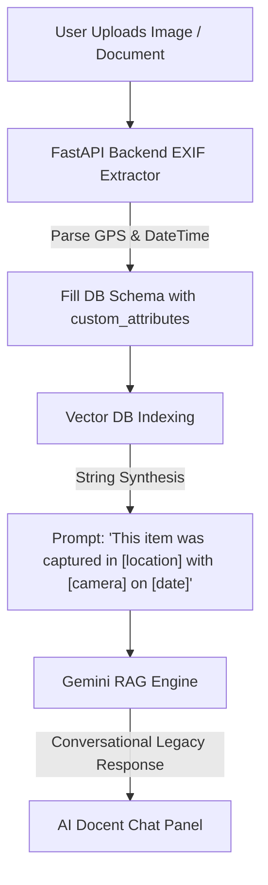

# 🌌 REMEMBERY
### *The Eternal Digital Heritage Archive & AI-Curated Personal Museum*

<p align="center">
  
</p>

<p align="center">
  <a href="https://react.dev/"></a>
  <a href="https://tailwindcss.com/"></a>
  <a href="https://www.typescriptlang.org/"></a>
  <a href="https://fastapi.tiangolo.com/"></a>
  <a href="https://deepmind.google/technologies/gemini/"></a>
  <a href="https://www.sqlite.org/"></a>
</p>

<p align="center">
  🌐 <b>Read this in:</b> <a href="README.ko.md"><b>한국어 (Korean)</b></a> | 📖 <b>Full Guidelines:</b> <a href="MANUAL.md"><b>English Manual</b></a> / <a href="MANUAL_ko.md"><b>Korean Manual</b></a>
</p>

---

> [!NOTE]
> **Remember (To Honor) + Library (Knowledge Repository)**  
> *"Every human life is like a massive, unique library. We illuminate a guiding light so that this library never fades into dust, allowing you to share your knowledge in your own voice forever."*

---

## 💡 1. The Vision & Philosophy

Current digital memorial systems and knowledge management platforms have clear market limitations:
*   **Memorial Services lack depth**: Existing memorial sites only list simple photos and text, sorely lacking technical integration, cognitive search, and semantic intelligence.
*   **KM Tools lack emotion**: Tools like Notion or Obsidian excel at database management but are cold, sterile, and incapable of celebrating a loved one's legacy or connecting generations.

**Remembery** shatters these limitations by presenting the **perfect fusion of a rational knowledge archive and an emotional digital memorial**:

```text
┌─────────────────────────────────────────────────────────────────────────┐
│                       THE PARADIGM SHIFT IN LEGACIES                     │
├────────────────────────────────────────┬────────────────────────────────┤
│  Traditional Methods (Cold & Static)   │  Remembery (Warm & Dynamic)    │
├────────────────────────────────────────┼────────────────────────────────┤
│  • Dry Cloud Storage (Files, Folders)  │  • Cinematic Chronicle Flow    │
│  • Passive Social Media Feeds          │  • AI-Curated Spatial Museum   │
│  • Unstructured Memories               │  • EXIF-Driven Geo-Chronology  │
│  • Search-less Photo Albums            │  • Conversational AI Docent    │
└────────────────────────────────────────┴────────────────────────────────┘
```

*   **During your lifetime (Alive)**: It acts as an elegant, highly structured personal library to preserve your portfolios, research papers, diaries, and memoirs.
*   **As a legacy (Posthumous)**: Without any complex migration, the entire archive seamlessly transitions into a warm, interactive digital monument for future generations.

---

## 🚀 2. Core Intelligent Features

Remembery combines advanced AI processing with high-fidelity React and Tailwind CSS UI/UX to deliver a premium user experience:

### 🤖 True RAG-Powered AI Docent & Attribute Synthesis
Converses with visitors in your own legacy tone and manner. Powered by the **Gemini API**, the semantic search engine synthesizes dynamic custom attributes (e.g. *“This paper was written by [name] and published in [journal] in [year]”*) into structured context sentences to maximize search relevance.



### 🏛️ AI-Curated Theme Exhibition Hall
AI automatically curates your milestones into a virtual gallery based on specific themes or years.

| Theme 🎨 | Visual Essence 🏛️ | Experience Tone |
| :--- | :--- | :--- |
| **Classic Museum** | Warm, comforting classic ivory and tan | Timeless, traditional gallery feel |
| **Burgundy Classic** | Sophisticated and regal deep crimson | Premium, intellectual, emotional depth |
| **Forest Heritage** | Refreshing and lush botanic green | Calming, naturalistic, growth-focused |
| **Ocean Deep** | Calm, contemplative deep navy blue | Thoughtful, expansive, serene |
| **Charcoal Midnight** | High-contrast, theatrical dark-room gallery | Spotlight-focused, modern dramatic contrast |

*   **4 Curated Room Layouts**: 
    1. `Docent Flow` (Vertical chronological story walkthrough)
    2. `Golden Frame Grid` (Items aligned symmetrically within beautiful gilded borders)
    3. `Cinematic Spotlight` (Theatrical slideshow highlighting serif quote banners)
    4. `Bento Collage` (Dynamic, modern asymmetrical masonry grid)

### ⏳ Cinematic Chronological Timeline Flow
Sorts all archives by capture date and dynamically maps the protagonist's exact age at the time of each milestone (e.g., `2026 (Age 48)`). Uses native `IntersectionObserver` for smooth, high-performance scroll reveal animations.

### 📚 Hybrid JSON Custom Categories & AI Suggestions
Define adaptive metadata models for any type of archive (Papers, Sensory Diaries, Letters, Golf Scores, etc.).
*   **AI 추천 필드 받기 (AI Suggestions)**: Get structured key-value attribute recommendations from Gemini API inside `NewCategoryModal.tsx` and register them to local storage with a single click.

### 📸 On-the-fly Image EXIF Parsing & Auto-fill
*   Uploading photos triggers immediate, asynchronous hardware EXIF decoding.
*   Renders a beautiful **`UploadPreview`** container showing **Capture Time**, **Camera Model**, and **GPS Coordinates** as responsive chips.
*   **Smart Auto-fill**: Automatically re-formats EXIF dates and pre-fills the "Original Date" form, while matching GPS coords to custom location parameters instantly.

---

## 🛠️ 3. Full-Stack Tech Stack

Remembery leverages a robust, modern stack selected for durability, portability, and raw speed:

*   **Frontend Core**: `React 19` + `TypeScript 6.0` + `Vite`
*   **Styling Engine**: `Tailwind CSS v4` (CSS-first engine for smooth transitions & beautiful layouts)
*   **Icons & Motion**: `Lucide React` & native CSS `@keyframes` transitions
*   **Backend Server**: `FastAPI` (High-performance asynchronous ASGI Python server)
*   **Database & ORM**: `SQLite` (embedded, highly portable file database) + `SQLAlchemy 2.0` (Object-Relational Mapper)
*   **Image Processor**: `Pillow 11.3` (Decodes binary metadata headers and translates GPS DMS into decimal coordinates)
*   **AI Integration**: `Gemini API` (Semantic RAG, category recommendations, and docent curation)

---

## 💻 4. System Architecture

```text
                                  +---------------------------------------+
                                  |            CLIENT BROWSER             |
                                  |   (React 19 + Tailwind CSS v4 SPA)    |
                                  +-------------------+-------------------+
                                                      |
                                           HTTPS      | Fetch APIs
                                     (JSON Payload)    | (Port 8000)
                                                      v
                                  +-------------------+-------------------+
                                  |          FASTAPI BACKEND SYSTEM       |
                                  |   (ASGI / CORSMiddleware Allowed)     |
                                  +---------+-------------------+---------+
                                            |                   |
                                            |                   |
                                     SQLAlchemy ORM             | Semantic RAG Search
                                     (Local Queries)            | (Pillow EXIF & Gemini)
                                            |                   |
                                            v                   v
                                  +---------+-------+   +-------+---------+
                                  | SQLite Database |   |   Gemini /      |
                                  | (remembery.db)  |   | Vector Database |
                                  +-----------------+   +-----------------+
```

---

## 🏃‍♂️ 5. Quick Start (Local Setup)

### 🔌 1) Backend API Setup (FastAPI)

1. **Navigate to the backend folder**:
   ```bash
   cd backend
   ```

2. **Create and activate a Python virtual environment**:
   - **macOS / Linux**:
     ```bash
     python3 -m venv venv
     source venv/bin/activate
     ```
   - **Windows**:
     ```cmd
     python -m venv venv
     venv\Scripts\activate.bat
     ```

3. **Install dependencies**:
   ```bash
   pip install -r requirements.txt
   ```

4. **Launch the development server**:
   ```bash
   uvicorn app.main:app --reload
   ```

> [!TIP]
> *   The API server runs on **`http://127.0.0.1:8000`**.
> *   Access the live interactive Swagger documentation at **`http://127.0.0.1:8000/docs`**.

---

### 🎨 2) Frontend SPA Setup (React + Vite)

1. **Open a new terminal and navigate to the frontend folder**:
   ```bash
   cd frontend
   ```

2. **Install Node packages**:
   ```bash
   npm install
   ```

3. **Launch the Vite dev server**:
   ```bash
   npm run dev
   ```

> [!NOTE]
> *   The dev server will run on **`http://localhost:5173`**.
> *   Open the URL to view the premium ivory/linen glassmorphic Remembery dashboard.

---

## 📜 6. Completed Milestones & Roadmap

- [x] **React 19 + Tailwind v4** Premium Glassmorphic Museum Dashboard
- [x] **FastAPI + SQLAlchemy + SQLite** decoupled backend integration
- [x] Onboarding & Dynamic Legacy Biography Profile expansion
- [x] Legacy Chronological **Life Timeline Flow** with dynamic age rendering (`TimelineFlow`)
- [x] **AI Auto-Curated Exhibition Room** supporting custom themes and gilded golden frames
- [x] **AI Category Recommendations** ("AI 추천 필드 받기") and local storage schema registry
- [x] **Real-time Photo EXIF Parsing** on file change with high-fidelity `UploadPreview` tags
- [x] **Smart Form Auto-fill** mapping capture date and coordinates to custom category properties
- [x] **AI Docent RAG Q&A integration** utilizing custom metadata attribute synthesis

---

<p align="center">
  <b>Remembery</b> honors and preserves the unique footsteps of human lives. <br />
  Your stars, issues, and contributions are warmly welcome! ⭐
</p>
